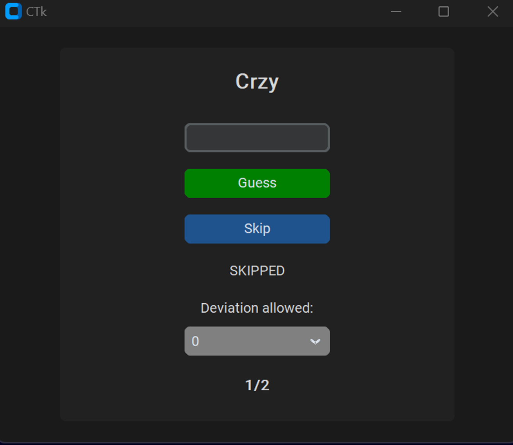

## Vowel game

**The rules of the game**

You will be shown a series of words with all their vowels removed. The objective of the game is to guess the original word.

**Interface** 

The word you are trying to guess will appear at the top of the window, and the text box below it is for you to type your guess.
In order to submit a guess, you may click 'Guess', or simply press Enter.
If you would like to skip a word, simply click 'Skip'. 
The 'Deviation Allowed' drop-down menu is a quality of life addition. By default, it is set to 0, meaning you must enter the original world exactly as it should be spelled to get a correct answer. If you set the Deviation Allowed to 1, then submitting the original word with 1 spelling mistake will still result in a correct attempt. 
Finally, the numbers at the bottom of the window keep track of your score. Failed guesses do not affect the score, however skipping a word does. The format used is (correct guesses / words attempted).

**Build**
In order to run, this application needs 2 modules from pip. You can install them to your python environment with the following commands: `pip install customtkinter` and `pip install levenshtein`.
From there, you can run the python code directly. 
Once run, it will ask you to point it to a .txt file. This is the input file. Different words must be separated by new lines, please refer to the example file provided.

Have fun!
